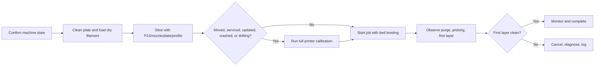

# SOP - Bambu Lab P1S

**Purpose:** Consistent enclosed FDM prints on the Bambu Lab P1S.  
**Skill level:** Intermediate after lab 3D-printer onboarding; Level 2 approval for ABS/ASA, abrasive, high-temperature, or AMS multi-material jobs.  
**Last verified:** TBD - complete after physical audit and first validation print.

## Preflight

- [ ] Review [`safety.md`](./safety.md); confirm material is approved for the room and operator level.
- [ ] Confirm printer identity, firmware baseline, nozzle size/material, build plate type, and AMS state in [`machine-card.md`](./machine-card.md).
- [ ] Empty purge waste and clear the chute.
- [ ] Inspect the build plate for residue, gouges, bubbles, or fingerprints. Clean per plate type.
- [ ] Inspect nozzle area for stuck purge, damaged silicone sock, bent nozzle, or loose front cover.
- [ ] Confirm filament is dry, labeled, and compatible with the selected feed path. Use external spool for TPU unless documented otherwise.
- [ ] In Bambu Studio, select **Bambu Lab P1S**, the installed nozzle, the actual plate, and the approved filament/profile.
- [ ] Slice and preview: verify units, orientation, supports, brim, purge tower/prime tower, estimated material, and collision risk.
- [ ] Enable bed leveling for normal jobs unless a maintainer intentionally disables it for a documented diagnostic.
- [ ] Run full printer calibration first if the printer was moved, serviced, updated, crashed, or is showing first-layer/ringing drift.

## Operation

1. Send the job from Bambu Studio or the approved local workflow.
2. Watch homing, purge, nozzle wipe, bed probing, and the first layer.
3. Cancel immediately if the nozzle drags, the purge sticks to the toolhead, the plate setting is wrong, or the first layer lifts.
4. Keep the enclosure closed unless the material/profile explicitly calls for venting heat, such as some PLA workflows. Record that profile choice.
5. Monitor the first 10-15 minutes for feed faults, AMS clicking, heat creep, odor, or unusual vibration.
6. For multi-material jobs, confirm every AMS slot maps to the expected filament color/type before starting.
7. If a pause or fault occurs, preserve the error message and job file name in the incident log before clearing it.

## Postflight

- [ ] Let the plate cool enough for safe handling and easier release.
- [ ] Remove the flexible plate, flex gently, and avoid scraper force unless necessary.
- [ ] Inspect the part: first layer, corners, top surface, seams, dimensions if a validation run.
- [ ] Remove purge waste and failed scraps from the chamber and chute.
- [ ] For hygroscopic filament, unload or seal according to [`materials.md`](./materials.md).
- [ ] Record material, profile, plate, nozzle, and print outcome in [`logs/sample-run-log.csv`](./logs/sample-run-log.csv) for validation jobs.
- [ ] Record maintenance, calibration, nozzle changes, filter changes, AMS work, and anomalies in the appropriate log.

## Reference flow

## Sources

- Bambu Lab, *P1 Series Wiki*, https://wiki.bambulab.com/en/p1 - accessed 2026-06-23; setup, calibration, and maintenance hub.
- Bambu Lab, *Bambu Studio*, https://bambulab.com/en/download/studio - accessed 2026-06-23; slicer workflow source.
