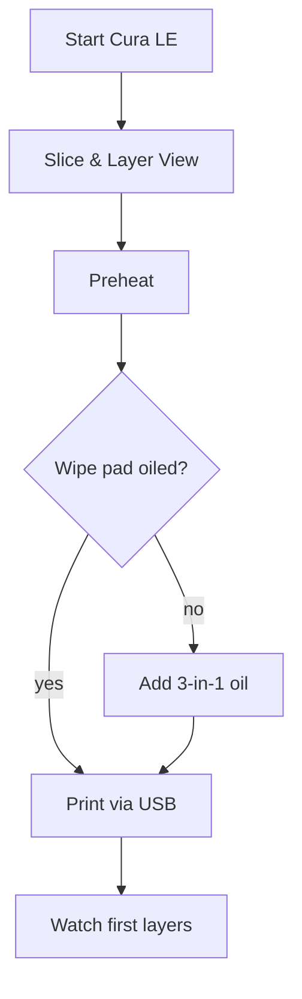

# SOP — LulzBot Mini 3

**Purpose:** Safe, consistent PLA/PETG printing on the open-frame LulzBot Mini 3.
**Skill level:** Intermediate maker (comfortable with Cura LE and auto-level cycles).
**Last verified:** 2025-02-14 — Taylor Kim & Omar Velez (operator interview during lunch run)

> Operator riff (Taylor, 2025-02-14): “The Mini only gets moody if you ignore the wiper pad—give it a fresh dab of oil.”

## Preflight (before every job)
- [ ] PPE: safety glasses, optional heat gloves for part removal.
- [ ] Clear 0.6 m perimeter; secure loose clothing—open-frame means nothing gets a free ride.
- [ ] Inspect PEI bed: wipe with 70% IPA; confirm surface temp <40 °C before starting.
- [ ] Check wipe pad: refresh 1–2 drops of 3-in-1 oil per **LulzBot Mini 3 User Guide §4.2**; replace pad if crusty.
- [ ] Verify filament: 2.85 mm spool spins freely on stand; guide tube seated.
- [ ] Power on printer and computer; launch Cura LulzBot Edition with Mini 3 profile.
- [ ] In Cura, load STL; verify material profile, layer height, infill, supports; run “Layer View” for collision check.
- [ ] Preheat via Cura (Material → Preheat) to material setpoint (PLA 205 °C / Bed 60 °C) and extrude 20 mm manually to ensure flow.
- [ ] Confirm E-stop button clear and firmware version matches log (M115 output) monthly.

## Operation
1. In Cura click **Print via USB**; observe printer run homing and nozzle wipe on pad.
2. Watch auto-level probing (4 corners); abort if nozzle drags or pad missing.
3. Monitor first two skirt lines; adjust live Z (Tune → Babystep Z) within ±0.2 mm if squish not ideal.
4. Stay within earshot for first 5 layers; listen for clicking feeder (indicates tension or clog).
5. For filament swaps mid-print, use “Pause → Change Filament” plugin; purge until color clean, then resume.
6. If print stalls, note layer/time, cancel via LCD knob, and document in incident log.

## Postflight
- [ ] Allow bed to cool below 40 °C before removal; flex plate gently or use spatula parallel to bed.
- [ ] Trim skirts/brims; vacuum stray filament.
- [ ] Heat nozzle to 160 °C and wipe with brass brush; set back to 0 °C.
- [ ] Run “Cooldown & Motors Off” from LCD.
- [ ] Power off printer and USB hub if final job; leave Cura notes in digital log (material, profile tweaks).
- [ ] Log job, nozzle used, and any babystep adjustments in `/machines/lulzbot-mini-3/logs/maintenance-log.csv`.

## Photos / Diagrams

**Reference manuals:**
- LulzBot, *Mini 3 User Guide* (2023), https://www.lulzbot.com/downloads/Mini3_User_Guide.pdf.
- LulzBot, *Cura LulzBot Edition Manual* (2024), https://www.lulzbot.com/software.
