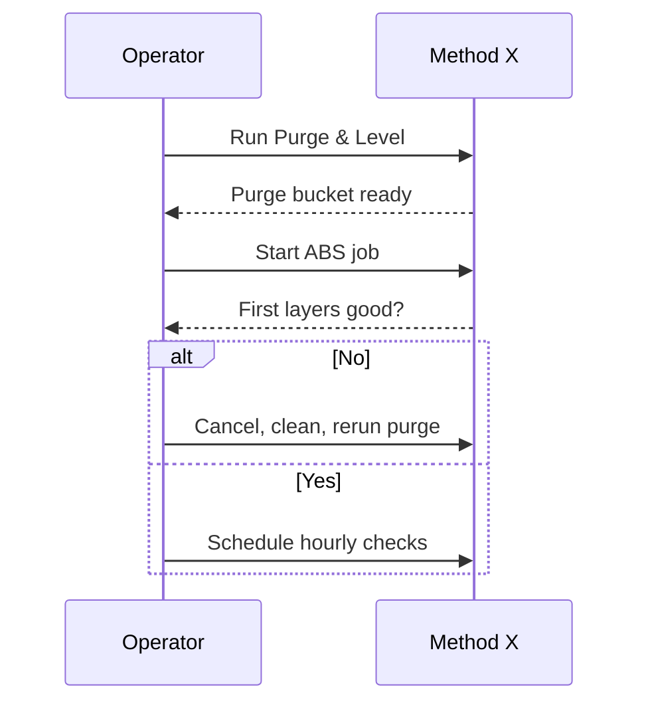

# SOP — MakerBot Method X

**Purpose:** Reliable ABS, ASA, and Nylon prints using the enclosed MakerBot Method X platform.
**Skill level:** Advanced operator (comfortable with heated chamber, purge routines, and material bays).
**Last verified:** 2025-02-14 — Jordan Miles & Priya Desai (evening operator interview)

> Operator note (Jordan, 2025-02-14): “If the purge bucket is crusty, today's print is already compromised—clean it first.”

## Preflight (before every job)
- [ ] PPE: safety glasses, heat-resistant gloves available, respirator if printing ABS for >2 h in low-ventilation mode.
- [ ] Verify chamber ventilation damper open and HEPA/carbon filter indicator <80% per **Method X Safety Guide §1.5**.
- [ ] Inspect build plate: remove previous raft, confirm spring steel plate locked and magnetic base wiped with IPA.
- [ ] Check material bays: ensure extruder type matches material (Model 1A for ABS, Support 2XA for SR-30) and desiccant lights green.
- [ ] Confirm spool dryness—if humidity >30% RH (displayed), bake spool or swap.
- [ ] Run “Utilities → Purge and Level” sequence (includes auto-calibration and purge bucket cleanout) if last run >24 h ago.
- [ ] Load job in MakerBot CloudPrint with Method X profile; verify chamber temperature (ABS 110 °C), build plate (105 °C), and support style.
- [ ] Ensure purge bucket empty; line with foil insert if printing dissolvable support.
- [ ] Review E-stop accessibility; confirm remote monitoring camera online if leaving room during print.

## Operation
1. From touchscreen choose **Print → Local Storage/Cloud** and select job; review summary (materials, chamber temp, duration).
2. Confirm doors latched; start print and observe for full purge cycle (model then support). Cancel and clean if purge strands curl back.
3. Watch first 2 layers through door glass; ensure chamber reaches setpoint before leaving.
4. For long prints, schedule chamber check every 60 minutes—verify spool feed and listen for clicking extruder.
5. If “Filament Runout” alert appears, follow on-screen reload instructions; resume only after purge lines laid cleanly.
6. For dissolvable support jobs, prepare rinse bath (lukewarm) before print completes.
7. Log any “Calibration Drift” notifications in maintenance file and alert next shift.

## Postflight
- [ ] Allow chamber to cool below 60 °C before opening; wear gloves to remove build plate.
- [ ] Flex plate to release part; transfer to support removal area immediately if using SR-30.
- [ ] Scrape purge bucket clean; discard waste per ABS disposal guidance.
- [ ] Wipe chamber window and LED lens with microfiber if fumes condensed.
- [ ] Return plate to magnetic base; leave printer idle with doors closed to retain warmth if next job <4 h away.
- [ ] Power down via touchscreen “Shutdown” then main switch if last job of day.
- [ ] Record material lots used, chamber filter %, and any purges/calibration actions in `/machines/makerbot-method-x/logs/maintenance-log.csv`.

## Photos / Diagrams

**Reference manuals:**
- MakerBot, *Method X User Guide* (2024), https://support.makerbot.com/s/article/Method-X-User-Guide.
- MakerBot, *Method Material Handling Guide* (2023), https://support.makerbot.com/s/article/Method-Material-Guide.
