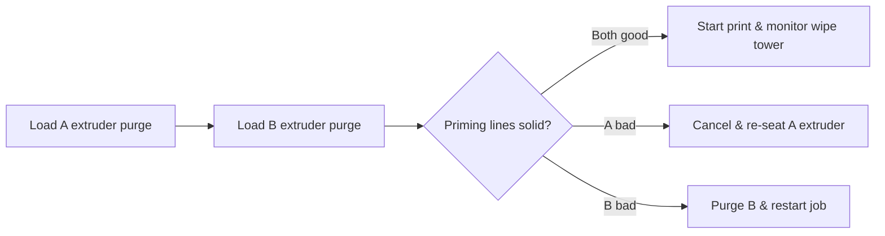

# SOP — MakerBot Sketch+

**Purpose:** Consistent dual-extrusion or high-throughput prints on the MakerBot Sketch+.
**Skill level:** Intermediate (comfortable with slicer profiles, nozzle swaps with mentor backup).
**Last verified:** 2025-02-14 — Priya Desai & Morgan Lee (operator sync interview)

> Operator reminder (Morgan, 2025-02-14): “Treat the B extruder like a fancy guest—purge it before every fancy color swap.”

## Preflight (before every job)
- [ ] PPE: safety glasses, fitted sleeves, nitrile gloves if handling carbon-filled filament.
- [ ] Workspace staged: remove stray spools, clear top vent, confirm enclosure doors close cleanly.
- [ ] Build plate cleaned with IPA; apply adhesion sheet or glue per material note (ABS-like → MakerBot Build Plate Tape) referencing **Sketch+ Hardware Guide §4.1**.
- [ ] Inspect both extruders: ensure Smart Extruder+ modules latch with audible click; wipe nozzles with brass brush while cold.
- [ ] Verify filament paths: spool matches assigned extruder (A=left, B=right) and materials loaded per job card.
- [ ] Run “Calibration → Z Offset” and “Extruder Offset” if swapping between single- and dual-extrusion jobs.
- [ ] Heat to material presets (PLA 215 °C / Tough 230 °C) and perform 80 mm purge for each extruder.
- [ ] Load file via MakerBot CloudPrint; confirm extruder assignment, support generation, and raft type (Standard vs. Base) per job traveler.
- [ ] Check E-stop and verify “Pause → Change Filament” workflow this week; record test date in maintenance log.

## Operation
1. Tap **Print → Cloud Library** and pick the prepared build; confirm active extruders shown at top of screen.
2. Confirm build plate clamps engaged and build chamber LED on.
3. Start print; observe sequential priming lines for extruder A then B—cancel if either line skips or curls.
4. Monitor first 10 layers: ensure wipe tower adhering and not invading model footprint.
5. During print, keep doors closed; use side window to check for cross-color oozing—trigger “Pause → Adjust Temps” if drooling.
6. For mid-print filament changes, use on-screen prompts; trim filament end at 45° before reload.
7. Document any dual-extrusion offset tweaks in job notes for next operator.

## Postflight
- [ ] Cool to <35 °C chamber temperature before opening doors.
- [ ] Remove build plate; flex to release prints, preserving purge tower for inspection.
- [ ] Clip any mixed-color purges and discard; log unusual color mixing in incident log.
- [ ] Brush nozzles while warm (150 °C) to prevent carbonization.
- [ ] If idle >12 h, unload both filaments and insert desiccant plugs.
- [ ] Power down via touchscreen “Shutdown” then rear rocker if final shift.
- [ ] Record job completion, materials, and any calibration performed in `/machines/makerbot-sketch-plus/logs/maintenance-log.csv`.

## Photos / Diagrams

**Reference manuals:**
- MakerBot, *Sketch Large / Sketch+ User Guide* (2024), https://support.makerbot.com/s/article/SKETCH-Large-User-Guide.
- MakerBot, *CloudPrint User Manual* (2024), https://support.makerbot.com/s/article/CloudPrint-Guide.
