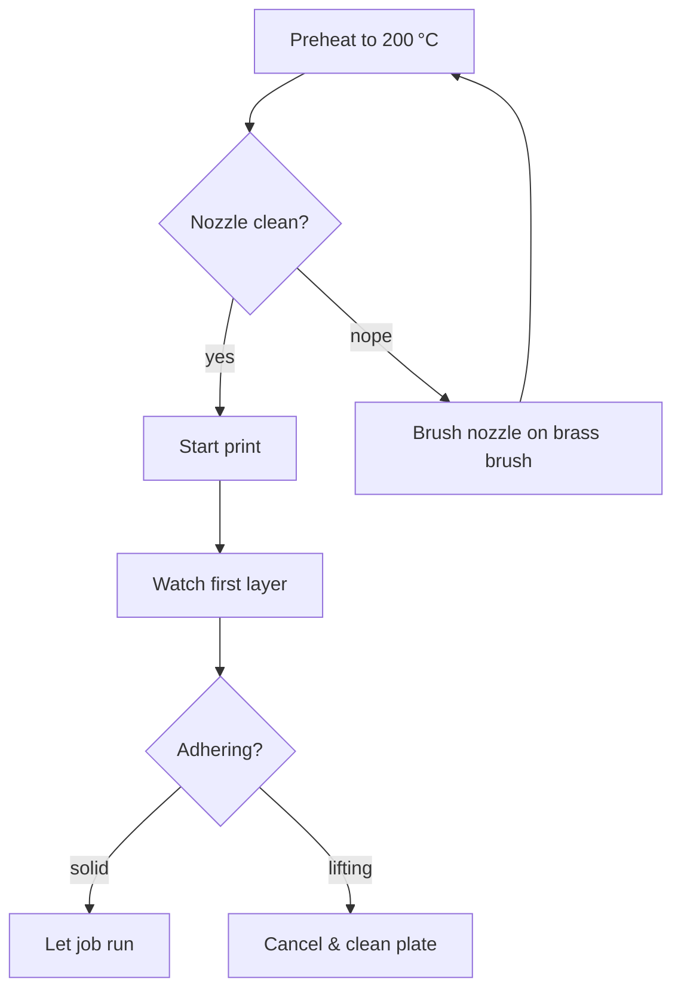

# SOP — MakerBot Sketch

**Purpose:** Daily operation of the MakerBot Sketch for PLA prints in the communal lab, from preflight to shutdown.
**Skill level:** Beginner-friendly with supervision for first two prints.
**Last verified:** 2025-02-14 — Alex Rivera & Priya Desai (shift hand-off interview)

> Operator takeaway (Alex, 2025-02-14): “If you can't smell the preheat yet, you probably skipped the nozzle wipe.”

## Preflight (before every job)
- [ ] PPE donned: safety glasses, tied hair, no dangly jewelry.
- [ ] Clear 0.5 m radius around the printer; remove prior prints and tools.
- [ ] Inspect build plate: PEI sheet clean, light glue stick mist if printing PLA/raft per **MakerBot Sketch User Guide §3.3**.
- [ ] Confirm filament spool matches job (diameter 1.75 mm PLA) and ≥2× estimated length; re-seat spool arm and filament guide.
- [ ] Power on printer; verify touchscreen boots without errors.
- [ ] Run “Utilities → Level Build Plate” if the printer was moved or last auto-level >7 days ago (log in maintenance file).
- [ ] Heat extruder to 200 °C via “Preheat PLA,” then brush nozzle on brass brush while hot.
- [ ] Load job in MakerBot CloudPrint; verify orientation, supports, raft, and print mode (Standard or Draft) match operator note.
- [ ] Confirm E-stop location and test pause/resume in interface this week (log test date in maintenance log).

## Operation
1. On touchscreen tap **Print → Cloud Library**, select the queued job, and review estimated time/material.
2. Confirm build plate is clipped in place; tug forward gently per **User Guide §2.4**.
3. Start print; observe first layer. If adhesion fails within first 5 layers, cancel, clean, and restart.
4. While printing, keep enclosure doors closed; monitor via top window every 10 minutes for first 30 minutes.
5. Listen for irregular grinding—if heard, pause print and check for filament tangles or Z-limit obstruction.
6. For multi-color prints (if using pause), use touchscreen “Pause” and swap filament only after nozzle retracts fully.
7. Record any anomaly (skipped layer, blob) in incident log with timestamp and job name.

## Postflight
- [ ] Allow part to cool to <40 °C (touchscreen temperature readout) before removal.
- [ ] Flex build plate gently to release print; use provided spatula only if necessary, slicing parallel to sheet.
- [ ] Trim ooze shield/brim over trash, not on PEI surface.
- [ ] Vacuum/brush crumbs; wipe plate with IPA if glue buildup visible.
- [ ] Unload filament if switching color or if printer idle >24 h (Utilities → Unload Filament).
- [ ] Power printer to standby (screen sleep) if more jobs are queued; full shutdown via rear switch only at end of day.
- [ ] Log job completion, filament color/lot, and any quirks in `/machines/makerbot-sketch/logs/maintenance-log.csv`.

## Photos / Diagrams

**Reference manuals:**
- MakerBot, *SKETCH Classroom Hardware Guide* (2023), https://support.makerbot.com/s/article/SKETCH-Hardware-Guide.
- MakerBot, *CloudPrint User Manual* (2024), https://support.makerbot.com/s/article/CloudPrint-Guide.
